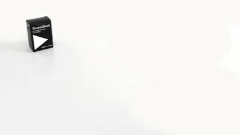

# DXC Security ThreatDeck Card Game

[![CC BY-SA 4.0][cc-by-sa-shield]][cc-by-sa]

ThreatDeck by [DXC Technology](https://dxc.technology) is licensed under a [Creative Commons Attribution-ShareAlike 4.0 International License](http://creativecommons.org/licenses/by-sa/4.0/).
Based on a work at https://github.com/dxc-technology/ThreatDeck.

## About

This repository holds the source files to the [award winning](https://www.dxc.technology/au/press_releases/148006-dxc_technology_wins_2019_australian_information_security_association_cyber_security_outreach_program_of_the_year_award) DXC ThreatDeck Security playing card game. The latest release can be found in [releases](https://github.com/dxc-technology/ThreatDeck/releases/latest), with the print materials in the `ThreatDeck.zip` asset.

## Gameplay
Game rules and instructions can be found in [RULES.md](RULES.md) and [INSTRUCTIONS.md](INSTRUCTIONS.md) respectively.

## Construction
Extract the [`ThreatDeck.zip`](https://github.com/dxc-technology/ThreatDeck/releases/latest) archive.

### Printing
Print all PDFs in the root folder as a manually duplexed print job — the alignment on automatic duplexers seem to have rather poor tolerances being approximately 2-3 mm out on both axes, you may have better success with a local reprographics department or commercial print shop.

### Cardstock
Consumer / business grade printers limit cardstock options to the 200 gsm grammage / area density range, professional-grade playing cards are typically between 300 and 350 gsm, therefore if you desire a more professional level of stock feel and weight, you may wish to seek the services of a commercial print shop.

### Trimming
The cards have 5 mm bleed and include crop marks and trim lines for die-cutting, see [instructions](#Instructions) below for building cards without crop marks and trim lines. Dedicated crop marks and trim lines are available separately in the `crops` and `trims` directories of the archive.

## Maintainence

### Editing

The SVGs in [src](./src) are best edited in [Inkscape](https://inkscape.org) (a free open-source WYSIWYG SVG editor) or another vector graphics editor, whilst you can try updating the SVGs by hand, you will likely encounter challenges with how to wrap text.

### Building from source

If you wish to build the project please follow these instructions to build PDFs from the source SVGs.

#### Instructions

1. Download [Docker Desktop](https://www.docker.com/products/docker-desktop) 🐳
2. Clone this repoistory to your local machine ⬇
3. Open a terminal 💻
4. `cd` into the cloned directory. 📁
5. Build the docker image by running `docker build --tag threatdeck .`, grab a coffee, this can take five minutes ☕
6. Run the container using `docker run -v $(pwd):/usr/ThreatDeck threatdeck` on Linux or `docker run -v %cd%:/usr/ThreatDeck threatdeck` on Windows. 🏃‍♂️
7. After ~10 minutes `ThreatDeck.zip` will be produced in `./dist`. 🚀

The build process accepts the following optional arguments:
 - `-m` produces a four up layout with four cards per page, thus saving paper, note that it assumes duplexing along the long edge of a portrait page.
 - `-c` lays out elements with crop marks.
 - `-t` lays out elements with trim lines.
 - `-f` lays out elements with fold lines (where appropriate).

Use the following syntax to use these optional arguments `docker run -v $(pwd):/usr/ThreatDeck threatdeck -mctf`.

This work is licensed under a [Creative Commons Attribution-ShareAlike 4.0 International License][cc-by-sa].

[![CC BY-SA 4.0][cc-by-sa-image]][cc-by-sa]

[cc-by-sa]: http://creativecommons.org/licenses/by-sa/4.0/
[cc-by-sa-image]: https://licensebuttons.net/l/by-sa/4.0/88x31.png
[cc-by-sa-shield]: https://img.shields.io/badge/License-CC%20BY--SA%204.0-lightgrey.svg
